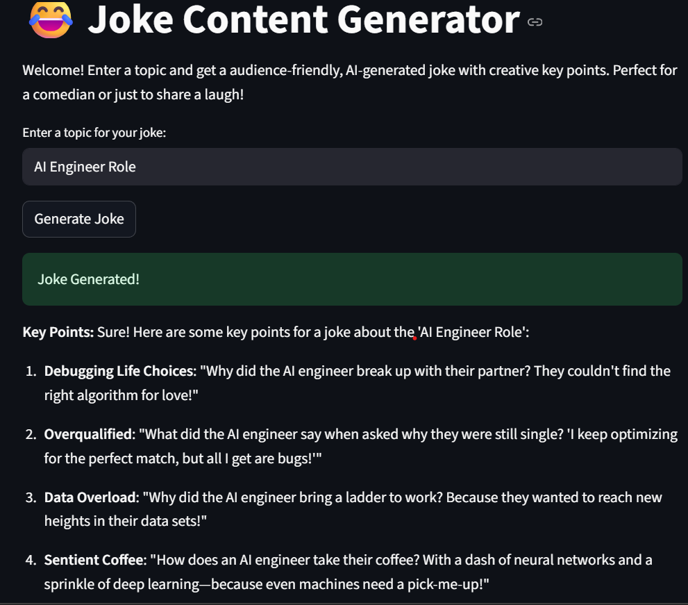

# Joke Content Generator 🎉

A modern, Streamlit app that generates creative jokes based on any topic you provide! Powered by OpenAI and LangGraph, this project demonstrates clean architecture and production-ready code. This can help comedians to get some innovative ideas beforehand.

## Features
- Enter any topic and get a witty, original joke
- See the creative key points used to generate the joke
- Modern, attractive Streamlit UI
- Modular code (logic separated from UI)
- Easy to extend for other content types

## Demo
[Joke Content Generator App](https://joke-generator-app.streamlit.app/)




## Setup Instructions

1. **Clone the repository**
   ```bash
   git clone https://github.com/ritik1704/Joke-Generator-app.git
   cd joke-content-generator
   ```

2. **Install dependencies**
   ```bash
   uv init

   uv venv --python 3.12.7

   venv/Scripts/activate

   uv sync
   ```

3. **Set up your OpenAI API key for local use**
   - Create a `.streamlit/secrets.toml` file in the project root:
     ```toml
     OPENAI_API_KEY = "your_openai_api_key_here"
     ```

4. **Run the app**
   ```bash
   streamlit run joke_generator_app.py
   ```

## Project Structure
```
joke_generator_app.py         # Streamlit UI
joke_generator/
    __init__.py
    generator.py              # Core joke/keypoint generation logic
README.md
```

## How it Works
- The app uses LangGraph and OpenAI to generate 3-5 creative key points for your topic.
- Then, it crafts a short, engaging joke using those key points.
- All logic is modular and easy to extend.

## Customisation
- Tweak the prompts in `joke_generator/generator.py` for different joke styles.
- Extend the app to generate other content types (quotes, stories, etc).

## License
Mozilla Public License Version 2.0


## Contact

For any questions or feedback, please contact Ritik Suri at [Ritik1704@gmail.com](mailto:Ritik1704@gmail.com).
